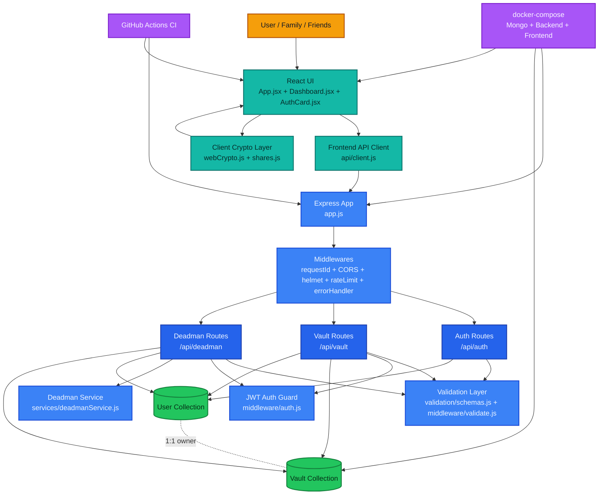

# Digital Will Architecture

## 1) High-Level Overview

Digital Will is a full-stack application with:

- Frontend: React + Tailwind CSS
- Backend: Node.js + Express
- Database: MongoDB (Mongoose)
- Security: JWT auth + bcrypt hashing + request validation + rate limiting
- Crypto: Browser-side Web Crypto (AES-GCM + PBKDF2) + Shamir Secret Sharing

Core principle:

- Vault content is encrypted in the browser.
- Backend stores encrypted data and recovery state, not decrypted vault plaintext.

## 2) Connected System Diagram

## 3) Data Relationship Snapshot

- `User` owns exactly one `Vault` (`owner` is unique in Vault)
- `Vault` contains `friends[]` (exactly 5 entries)
- `Vault` contains `submittedShares[]` (grows during recovery)
- Vault payload is stored encrypted (`encryptedVault`, `iv`, `salt`)
