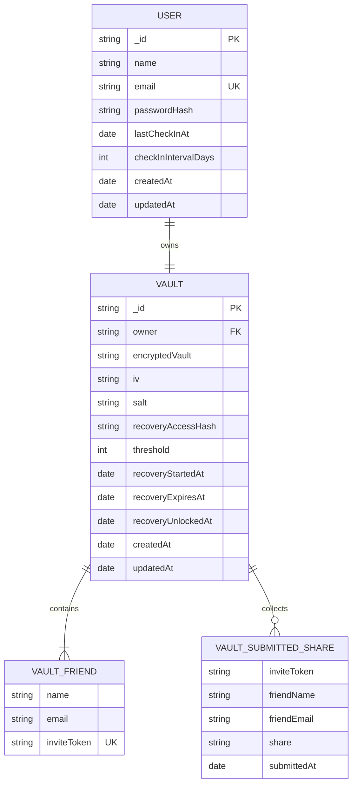

# Digital Will ER Diagram

```mermaid
erDiagram
    USER ||--|| VAULT : owns
    VAULT ||--|{ VAULT_FRIEND : contains
    VAULT ||--o{ VAULT_SUBMITTED_SHARE : collects

    USER {
        string _id PK
        string name
        string email UK
        string passwordHash
        date lastCheckInAt
        int checkInIntervalDays
        date createdAt
        date updatedAt
    }

    VAULT {
        string _id PK
        string owner FK
        string encryptedVault
        string iv
        string salt
        string recoveryAccessHash
        int threshold
        date recoveryStartedAt
        date recoveryExpiresAt
        date recoveryUnlockedAt
        date createdAt
        date updatedAt
    }

    VAULT_FRIEND {
        string name
        string email
        string inviteToken UK
    }

    VAULT_SUBMITTED_SHARE {
        string inviteToken
        string friendName
        string friendEmail
        string share
        date submittedAt
    }
```

- `USER -> VAULT` is one-to-one.
- `friends[]` and `submittedShares[]` are embedded arrays in `Vault`.
